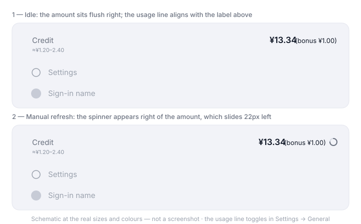

<p align="center">
  
</p>

# dsh-quota-usage

[中文](README.md) | English

[](https://github.com/lbqcgza/dsh-quota-usage)
[](LICENSE)


A sidebar-foot widget for DeepSeek Harness: it shows your account's **remaining credit** directly
**above your user name**, and refreshes on click.



Idle, the amount sits flush right; click the row to refresh, and the spinner appears only then.

## Install

Install it from DSH with `plugin_manager` (Creator mode, or the Plugins page in Settings):

```sh
plugin_manager install_bundle  target = github:lbqcgza/dsh-quota-usage
```

A path to a local clone of this repository works the same way:

```sh
plugin_manager install_bundle  target = <absolute path to this repo>
```

**Restart the desktop app once after installing.** The client boot graph is captured once when the
host process starts, so a page refresh cannot pick up a newly added client module — unlike most DSH
plugins. The reason is in [Implementation notes](#implementation-notes). On `dsh web`, a page
refresh is enough.

Once it is up, a `Credit` row appears at the sidebar foot, **above** the row holding `Settings` and
your avatar / user name.

**Requires DSH 0.2.0-rc.2 or newer, on a Web client** (the desktop app or `dsh web`). It depends on
the `sidebar.footer.action` seat and the shipped `remote.account` namespace, so headless / SDK / ACP
profiles without a Web client are not supported.

## What you get

- **The total at a glance** — the headline is the sum of Platform's recharge wallets (`normal_wallets`) and bonus wallets (`bonus_wallets`) in one currency; the parenthesized part is the bonus, and **below one cent (zero included) the whole bracket goes away with its cell** rather than leaving a gap or a `<0.01` noise value
- **A usage sub-title** — one line under the credit shows the **current session's** real token count and an **estimate** of what it cost (see [Usage sub-title](#usage-sub-title)); with no session open the line is not rendered and the widget stays one line
- **Click to refresh** — clicking the row re-reads immediately and shows a circular spinner to the right of the amount for exactly as long as the read runs. Background polling, refocusing the window, and account state changes never flash the spinner
- **The make-room motion is eased** — the amount sits flush to the right edge when idle (no space reserved for the spinner) and slides 22px left while it is up, on `cubic-bezier(.22,.61,.36,1)`. Only `transform`/`opacity` animate, so nothing reflows
- **It never silently disappears** — loading, failed, not connected, and signed out each say so. A widget that quietly does not appear is indistinguishable from a broken plugin, so this one always renders its state
- **It cannot take the boot down** — every mount step is isolated, and a failure parks a trace where it can be read back. That is not just tidiness: on the desktop, one entry that fails to activate aborts the whole page boot, and the launcher's recovery path rewrites your profile
- **No telemetry** — nothing is written to disk or reported; the balance is read from the official account API with exactly the metadata the official account page sends
- **Follows your UI language** — bilingual, switched by DSH's language setting

## What it looks like

It occupies one row at the sidebar foot, above `sidebar.settings` (the Settings control plus the
account launcher).

| Phase | Shown | Meaning |
| --- | --- | --- |
| `loading` | Loading… | The first read has not returned |
| `ready` | `¥13.34 (bonus ¥1.00)` | Normal |
| `failed` | Unavailable | The Remote call failed (the last good value is kept) |
| `unavailable` | Not connected | The page has no `remote.account` service yet; retrying fast |
| `signed-out` | Signed out | The host holds no usable credential |

The tooltip carries the breakdown and the cadence:

```text
Total credit ¥13.34 · Recharge balance ¥12.34 · Bonus balance ¥1.00 · Updated 14:32 · Auto refresh every 60s · Click to refresh now
```

Collapsed into the 56px rail (macOS / plain Web) it becomes a 36px circular button with the number
centered and the spinner as a ring around it. Under the Windows native title bar, collapsing the
sidebar hides the whole foot area, so it hides together with the user-name row. The rail shows no
usage sub-title — 36px has no room for it.
## Usage sub-title

The line under the credit is the **current session's** estimated usage, and it forms one
label/value list with the row above it:

```text
Credit    ¥13.34 (bonus ¥1.00)
Session  ≈¥1.20–2.40
```

Both rows share one layout: `Credit` / `Session` are the left label column (`flex:none`, so the two
labels share a left edge), and each value is pinned with `margin-left:auto` to the same right edge.
**A `<button>` carries `text-align: center` from the UA stylesheet, which would centre the text of a
full-width child**, so the row sets `text-align: left` explicitly (a CSS contract test locks it).

- **The amount is an estimate** — the session log records **tokens only, never money** (DSH ships no price list either), so it is derived from the official price list: `deepseek-flash` at 0.02 (cached input) / 1 (uncached input) / 4 (output) CNY per million tokens off-peak, doubled at peak
- **The token count lives in the tooltip** — it comes from the `tokenUsage` projection (a replay of the whole persisted log, so paging and compaction do not change it), grouped the way DSH itself groups the prompt side: the three disjoint buckets `uncachedInputTokens` + `cacheReadTokens` + `cacheWriteTokens`, plus `outputTokens`. Hover for the exact count; the sub-title shows only money

Two sources of error are inherent to the data rather than the arithmetic:

1. **It can only be a range** — the projection has no per-request timeline, so historical tokens cannot be attributed to peak or off-peak hours after the fact; both bands are computed and shown as `¥1.20–2.40`. Peak hours are Beijing time Mon-Fri 09:00-12:00 and 14:00-18:00, excluding public holidays
2. **Cache writes are priced as cache misses** — the official list has only a hit and a miss column for the prompt side, so `cacheWriteTokens` is billed at the miss rate, matching DSH's own prompt-side grouping

### The switch

**Settings → General → Credit usage sub-title** turns the line off. The choice is kept in
the browser (`dsh-quota-usage:show-usage` in `localStorage`, the only key this plugin
writes), and switching it off removes both the sub-title and the usage segment of the
tooltip. With no session open the line is not rendered at all and the widget stays a
single row.

### Scope

This line covers **the current session only**. The seat the credit row uses,
`sidebar.footer.action`, is root-scoped, and projections like `tokenUsage` can only be read
from a session scope — so the plugin also mounts an invisible bridge component in the
session-scoped `conversation.composer.dock` and hands the reading to the foot row. Covering
a whole **workspace** (including sessions that were never opened) would need a host half
aggregating the session logs, which brings a local HTTP route and does not fit the current
zero-network architecture, so it is not done.

## Refresh cadence

- One read on mount; **a 5s retry until the first result lands** (the account namespace is a service
  the host mounts asynchronously, so it can arrive after this plugin does), then 60s
- Re-read when the page becomes visible, when the window regains focus, and on connection reset
- Subscribes to the `account.watch` stream, so signing in or out re-reads immediately
- **Clicking the row** re-reads immediately and shows the spinner for that read
- Concurrent triggers collapse into one Remote call; a background call that overlaps your click
  shares the same request, and the spinner still covers it to the end

## Privacy and security

- **Holds no credentials** — no token, no account, no API key. The account token stays in the host, which is what performs the authenticated request; the client never receives it
- **Registers no HTTP routes** — the host half is an empty `apply` that exists only so the package holds a Loader row
- **Runs no commands and reads no files**
- **Exactly one outbound call** — `remote.account.getBalance`, the same namespace the shipped Settings → Account page reads. The metadata on it is **only** `version` (DSH build), `locale` (UI language), and `timezoneOffsetSeconds` (UTC offset) — the same three fields the official account pages send, with no device ID and no user ID
- **Writes no browser state**, with one exception: the display preference `dsh-quota-usage:show-usage` in `localStorage`, which remembers whether the usage sub-title is drawn. It never leaves the browser and never joins a request
- **No telemetry egress at all** — there is no `fetch` / `XMLHttpRequest` / `WebSocket` / `sendBeacon` anywhere in the code

Please report security problems through
[private vulnerability reporting](https://github.com/lbqcgza/dsh-quota-usage/security/advisories/new)
rather than a public issue; the boundaries that matter are described in [SECURITY.md](SECURITY.md).

## Known limitations

- Read-only: it offers no top-up or navigation. The Platform's native pages are owned by the shipped
  `ui-settings-account` shared host entry in `shell.overlay`, and a third-party plugin should not
  start a second one
- Bonus and recharge are read in the same currency; with several present it prefers CNY, otherwise
  the first wallet's currency
- Amounts follow Platform Web formatting: two decimals, digit grouping, and a positive sub-cent
  amount as `<0.01`. This is **display formatting only** — the raw balance string is not rewritten
- The spinner lasts as long as the request actually takes, so a fast network can make it a blink
- **A bonus under one cent is not shown** — the threshold is one cent (`MIN_VISIBLE_AMOUNT`): the formatter would only print `<0.01`, which is noise rather than a balance, so the cell is not rendered at all. The total is still computed from the real values; the threshold only affects display
- **The usage amount is an estimate, not a bill** — the log holds no money, so the figure is derived from the official price list and can only be a range; a price change means editing `PRICE_CNY_PER_MILLION` in the code. The token count is exact
- **Usage covers the current session only** — a workspace-wide total would need a host half and a local route; see [Usage sub-title](#usage-sub-title)
- `CLIENT_VERSION` is currently hardcoded to `0.2.0-rc.2` (it only labels the requesting client on
  the account API; it does not affect behaviour)

## Development and verification

```sh
npm test          # same as node test/smoke.mjs
npm run check     # syntax check plus the step above
```

`test/smoke.mjs` drives the **real `lib/client.js`** against stubs (a module loader, React, the DOM
bits, and a Cordis context). It needs no dependencies and no build, and CI runs it on Node 20 / 22 /
24.

It covers: the claimed seat and its props, the per-request metadata, every phase's rendering
(ready / rail / sub-cent / signed out / failed / USD), the spinner's behaviour (an empty reserved
slot while idle with no ring drawn, **no spinner for background polling**, a quarter arc that spins
only after a click, gone the moment the read settles, and `onClick` really taking the manual path),
the easing contract (`--dsh-quota-ease` must be a non-linear `cubic-bezier`, and no `transition` is
allowed to fall back to `linear`), and the self-diagnostics (the not-ready phase mirror, the mount
trace, and tolerating a second mount).

After editing `lib/client.js`, **disable and re-enable** the plugin from the Plugins page or
`plugin_manager` to make the page reload it — no app restart needed.

## Implementation notes

For DSH plugin authors. All three of these were measured, not guessed.

### 1. Reach the account namespace with `ctx.get("remote.account")`

The API gateway registers every Remote namespace as its **own Cordis service** under the dotted key
`` `remote.${namespace}` `` (`RemoteNamespaceService extends Service`). So the canonical lookup is
`ctx.get("remote.account")`; `ctx.remote.account` is only a nested accessor and may not be
materialized on a context that never injected the dotted key. That is exactly what makes a widget
register successfully and still show a blank balance forever.

This plugin falls back through `ctx.get("remote.account")` → `ctx.remote.account` →
`ctx["remote.account"]`, and **deliberately does not declare** `"remote.account"` in `inject`:
declaring a service that some deployments do not mount leaves the fiber pending, and the shell's
boot audit counts pending as a failure.

### 2. A throwing `apply` fails the whole page boot

The shell's activation audit (`web boot: N entry did not activate`) aborts the entire boot when any
entry's fiber is not `active`. The desktop then reports a web-boot crash
(`%APPDATA%\@deepseek-ai\dsh-desktop\logs\crash-*-web-boot.log`), and the launcher's recovery path
**rewrites the profile**, dropping extra entries from `dsh.profile.bundles` and overrides from
`cordis.patch.yml`.

So this plugin's `apply` **never throws outward**: each mount step is isolated, a failure records a
trace and leaves the plugin inert, and a small widget never takes the app down with it.

### 3. A newly added client plugin needs a desktop app restart

The desktop shell serves the SPA's `index.html` statically, and the boot graph (the client module
table behind `window.__DSH_BOOT__`) is captured **once, when the host starts**:

```js
const ready = await host.start();
injections = ready.injections;          // computed once, at app start
ipcMain.handle(DESKTOP_IPC.boot, () => ({ injections, streamBaseUrl }));
```

So after **adding a new row**, a page refresh cannot fetch its bundle either — the Loader entry is
already active, but the module table the page holds is stale. On `dsh web`, a page refresh does
re-render the boot graph. **Once the row exists**, though, disabling and re-enabling it makes the
page resync and reload it, with no restart.

## Diagnostics

- **A failed mount** — the trace stays in the page as a `shell.overlay` occupant id, shaped like
  `dsh-quota-usage-diag:bind=ok | dict=ok | … | seat=!<error>`, readable through the client Slot
  inspection; there is also one `console.error` line.
- **A read that is not ready** — whenever the phase is not `ready`, the plugin mirrors itself as a
  `dsh-quota-usage-state:<phase>` entry in `shell.overlay` and withdraws it once it has an amount.
  So "no state entry in the overlay" means that path never ran, and "a state entry" means it ran and
  is stuck at that phase.

## Friends

- [dsh-market](https://github.com/dsh-market/dsh-market) — the visual plugin market inside DSH. This
  repository's README structure, `.gitattributes`, and the shape of `SECURITY.md` follow its example
- [awesome-dsh-plugin](https://github.com/awesome-dsh-plugin/awesome-dsh-plugin) — the curated DSH
  plugin list

## License

MIT · [github.com/lbqcgza/dsh-quota-usage](https://github.com/lbqcgza/dsh-quota-usage)
