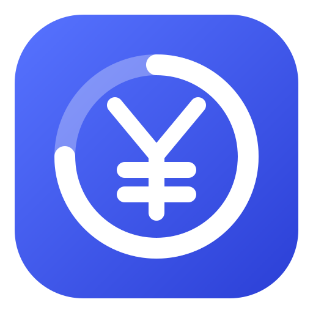
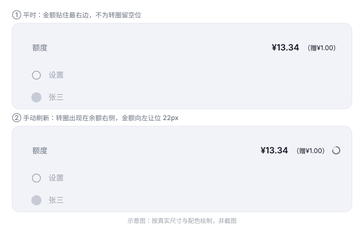

<p align="center">
  
</p>

# dsh-quota-usage

中文 | [English](README.en.md)

[](https://github.com/lbqcgza/dsh-quota-usage)
[](LICENSE)


装在 DeepSeek Harness 侧边栏底部的小组件：在你的**用户名正上方**显示账号**剩余额度**，点一下即刷新。



平时金额贴住最右边；点整行立即刷新，转圈只在这时出现。

## 安装

在 DSH 里用 `plugin_manager` 装（Creator 模式，或设置里的插件页）：

```sh
plugin_manager install_bundle  target = github:lbqcgza/dsh-quota-usage
```

也可以直接指向本仓库的本地克隆路径：

```sh
plugin_manager install_bundle  target = <本仓库绝对路径>
```

**装完要重启一次桌面 App。** 客户端模块的启动图只在宿主进程启动时生成一次，之后刷新页面也拿不到新插件 ——
这一点和多数 DSH 插件不同，原因见[实现要点](#实现要点)。`dsh web` 浏览器模式则刷新页面即可。

装好后：侧边栏底部、`设置` 与头像/用户名那一行的**上面**会多出一行 `额度`。

**需要 DSH 0.2.0-rc.2 或更新的 Web 版**（桌面版或 `dsh web`）。它依赖 `sidebar.footer.action` 槽位与官方
`remote.account` 命名空间；headless / SDK / ACP 这类没有 Web 客户端的 profile 不适用。

## 你会得到

- **总余额一眼看到** —— 主数值是 Platform 的充值余额（`normal_wallets`）与赠金余额（`bonus_wallets`）在该币种下的**合计**；括号里是赠金部分，**不足 1 分（含为 0）时整个括号连单元格一起不渲染**，不会留下空位或 `<0.01` 这种噪声
- **用量副标题** —— 额度下方一行显示**当前会话**的真实 token 数与该用量的**估算金额**（见[用量副标题](#用量副标题)）；没有会话打开时这一行不渲染，组件仍是单行
- **点一下就刷新** —— 点整行立刻重读一次，读取期间余额右侧出现圆形转圈，读完即消失；后台轮询、切回窗口、账号状态变化都不会闪出转圈
- **让位是缓动的** —— 金额平时贴住右边缘（不为转圈留空位），转圈出现时用 `transform` 平移让位 22px，曲线 `cubic-bezier(.22,.61,.36,1)`；只动 `transform`/`opacity`，不触发布局、不 reflow
- **不会静默消失** —— 读取中 / 读取失败 / 未连接 / 未登录都有明确文案。一个悄悄不出现的组件和一个坏掉的插件无法区分，所以它从不"什么都不显示"
- **不会拖垮启动** —— 每个挂载步骤都被隔离，出错只把排查痕迹留在可读回的位置。这不只是洁癖：桌面版一旦整页启动失败，启动器的恢复流程会重写你的 profile
- **零遥测** —— 不落盘、不上报、不接触 token；余额只从官方账号接口读，随请求的元数据与官方账号页逐字一致
- **跟随界面语言** —— 中英双语，随 DSH 的界面语言切换

## 显示效果

展开侧边栏时占两行，位置在 `sidebar.settings`（设置 + 账号 launcher）**上方**：

```text
  额度                     ¥13.34（赠¥1.00）   ← 本组件（用户名上方）
  本会话                 约¥1.20–2.40          ← 用量副标题
  ⚙ 设置
  (头像) 张三                                   ← 账号 launcher / 用户名
```

点击触发一次手动刷新时，金额向左让位，转圈出现在它的右侧：

```text
  额度               ¥13.34（赠¥1.00） ◌
  本会话           约¥1.20–2.40
```

| 阶段 | 显示 | 含义 |
| --- | --- | --- |
| `loading` | 读取中… | 首次读取尚未返回 |
| `ready` | `¥13.34（赠¥1.00）` | 正常 |
| `failed` | 读取失败 | Remote 调用失败（保留上一次有效数字） |
| `unavailable` | 未连接 | 页面还没有 `remote.account` 服务，正在快速重试 |
| `signed-out` | 未登录 | 宿主侧没有可用凭证 |

悬停提示给出拆分、用量与刷新节奏：

```text
总余额 ¥13.34 · 充值余额 ¥12.34 · 赠金余额 ¥1.00 · 更新于 14:32 · 每 60 秒自动刷新 · 本会话用量 1.28M tokens · 估算 ¥1.20–2.40 · token 取自会话日志；金额按官方价目表推算，不是账单金额（…） · 点击立即刷新
```

收起成 56px 轨道时（macOS / 普通 Web）变成 36px 圆形按钮，数字居中、转圈变成包住它的外圈；
Windows 原生标题栏下侧边栏收起时整个底部区域由 shell 隐藏，与用户名行一同隐藏。
轨道态不显示用量副标题（36px 放不下）。

## 用量副标题

额度下方那一行是**当前会话**的用量估算，与上面一行构成同一个"标签 + 金额"列表：

```text
额度      ¥13.34（赠¥1.00）
本会话  约¥1.20–2.40
```

两行共用同一套布局：`额度` / `本会话` 是左侧标签列（`flex:none`，所以两行的标签左边缘对齐），
金额都用 `margin-left:auto` 贴住同一个右边缘。**注意 `<button>` 的 UA 样式默认 `text-align:center`，
会把撑满宽度的子元素里的文字居中**，所以插件在行上显式设了 `text-align:left`（有 CSS 契约测试锁住）。

- **金额是估算** —— 会话日志里**只有 token、没有任何金额字段**（DSH 也不随包发布价格表），所以这一项由官方价目表推算：`deepseek-flash` 空闲时段 输入命中 0.02 / 输入未命中 1 / 输出 4（元每百万 tokens），高峰时段翻倍
- **token 数在悬停提示里** —— 它来自 `tokenUsage` 投影（整份持久日志的回放结果，分页与压缩不会改变它），口径与 DSH 自己一致：提示侧三个互斥桶 `uncachedInputTokens` + `cacheReadTokens` + `cacheWriteTokens`，加上 `outputTokens`。悬停可见精确 token 数，副标题只显示钱

两个估算固有的误差来源，都来自数据而不是算术：

1. **只能给区间** —— 投影没有逐请求时间线，历史 token 无法还原当时是高峰还是空闲，于是两档都算出来显示成 `¥1.20–2.40`。高峰时段是北京时间周一至周五 9:00–12:00、14:00–18:00（不含法定节假日）
2. **缓存写入按未命中计价** —— 官方价目表只有"缓存命中/未命中"两列，没有缓存写入列，所以 `cacheWriteTokens` 按未命中输入价计，与 DSH 自己的提示侧分组一致

### 开关

**设置 → 通用 → 额度用量副标题** 可以关掉这一行。开关状态记在浏览器本地（`localStorage` 的
`dsh-quota-usage:show-usage`，这是本插件唯一写入的键），关掉后副标题与悬停提示里的用量段一起消失。
没打开任何会话时这一行本来就不渲染，组件仍是单行。

### 范围限制

这一行**只覆盖当前会话**。额度行所在的 `sidebar.footer.action` 是 root 作用域，
而 `tokenUsage` 这类投影只能从会话作用域读到 —— 所以插件额外在会话作用域的
`conversation.composer.dock` 挂了一个**不渲染任何东西**的桥接组件，把读数交给额度行。
要做到"整个工作区"（含没打开过的会话）必须加 host 半侧去汇总会话日志，那会引入一个本地路由，
与当前"零网络"的架构不符，所以没做。

## 刷新节奏

- 挂载时读一次；**未拿到首个结果前每 5 秒重试**（账号命名空间是宿主异步挂载的独立服务，可能比本插件晚就绪），拿到后转为每 60 秒
- 页面重新可见、窗口获得焦点、连接重置时重读
- 订阅 `account.watch` 账号状态流，登录 / 登出后立刻重读
- **点击整行**立刻重读一次，并在读取期间显示转圈
- 并发去重：同时触发多个刷新只会发一次 Remote 调用；后台调用与你的点击重叠时共用一个请求，转圈仍会显示到该请求结束

## 隐私与安全

- **不持有凭据** —— 没有 token、没有账号、没有 API key。账号 token 由宿主持有并用于发请求，客户端从来拿不到它
- **不注册任何 HTTP 路由** —— host 半侧是空的 `apply`，只为让包在 Loader 里占一行
- **不执行命令、不读文件**
- **只发一次调用** —— `remote.account.getBalance`，与官方「设置 → 账号」页同源；随请求的元数据**只有** `version`（DSH 版本号）、`locale`（界面语言）、`timezoneOffsetSeconds`（UTC 偏移）三项，与官方账号页逐字一致，没有设备 ID / 用户 ID
- **不写浏览器状态** —— `localStorage`、`sessionStorage`、cookie、`indexedDB` 全无使用。**唯一的例外**是那一个显示偏好键 `dsh-quota-usage:show-usage`（用量副标题的开关状态），它不出浏览器、不参与任何请求
- **没有任何遥测出口** —— 代码里没有 `fetch` / `XMLHttpRequest` / `WebSocket` / `sendBeacon`

需要报告安全问题请用 [私密漏洞报告](https://github.com/lbqcgza/dsh-quota-usage/security/advisories/new)，
不要开公开 issue；判断边界见 [SECURITY.md](SECURITY.md)。

## 已知限制

- 只读展示，不提供充值或跳转。Platform 原生页面由官方 `ui-settings-account` 的 `shell.overlay` 共享宿主条目独占，第三方插件不应另起一个
- 赠送余额与充值余额取同一币种；多币种并存时优先 CNY，否则取第一个钱包的币种
- 金额按 Platform Web 口径显示：两位小数、千分位、正的亚分显示为 `<0.01`。这只是**展示格式化**，原始余额字符串不被改写
- 转圈时长 = 这次请求的真实耗时，网络快时可能一闪而过
- **赠金不足 1 分就不显示** —— 阈值是 1 分（`MIN_VISIBLE_AMOUNT`）：格式化后只会是 `<0.01`，那是噪声不是余额，所以连单元格一起不渲染；总余额仍按真实数值计算，不受显示阈值影响
- **用量金额是估算，不是账单** —— 日志里没有金额，估算由官方价目表推算，且只能给区间；价格调整后需要更新代码里的 `PRICE_CNY_PER_MILLION`。token 数是精确的
- **用量只覆盖当前会话** —— 工作区级汇总需要 host 半侧与本地路由，见[用量副标题](#用量副标题)
- `CLIENT_VERSION` 目前硬编码为 `0.2.0-rc.2`（只作账号接口的客户端标识，不影响功能）

## 开发与验证

```sh
npm test          # 等价于 node test/smoke.mjs
npm run check     # 语法检查 + 上面那步
```

`test/smoke.mjs` 用桩件跑**真实的 `lib/client.js`**（模拟模块加载器、React、DOM 与 Cordis 上下文），
无需依赖、无需构建。CI 在 Node 20 / 22 / 24 上跑同一套。

覆盖的内容：槽位与 props、每请求元数据、就绪/轨道/亚分/未登录/失败/USD 各状态渲染、
转圈的行为（平时只留空占位不画环、**后台轮询不显示**、点击后才出现四分之一弧并旋转、
读取 settle 后立即消失、`onClick` 确实走手动路径）、缓动契约（`--dsh-quota-ease` 必须是非线性
`cubic-bezier`，且显式禁止任何 `transition` 落到 `linear`）、自诊断（未就绪阶段镜像、挂载失败留痕、
重复挂载容忍）。

改完 `lib/client.js` 后，在插件页或 `plugin_manager` 里**停用再启用**该插件即可让页面重新加载，无需重启 App。

## 实现要点

这一节写给 DSH 插件作者 —— 三个都是踩出来的，不是推测。

### 1. 账号命名空间要用 `ctx.get("remote.account")`

API gateway 把每个 Remote 命名空间注册成**独立的 Cordis 服务**，key 是 `` `remote.${namespace}` ``
（`RemoteNamespaceService extends Service`）。所以规范查找是 `ctx.get("remote.account")`；
`ctx.remote.account` 只是嵌套访问器，在没有注入该 dotted key 的上下文里可能拿不到值 ——
那正是"组件注册成功、但余额永远空白"的原因。

本插件按 `ctx.get("remote.account")` → `ctx.remote.account` → `ctx["remote.account"]` 依次回退，
并且**故意不在 `inject` 里声明** `"remote.account"`：声明一个在某些部署下不存在的服务会让 fiber
一直 pending，而 shell 的启动审计把 pending 也算作失败。

### 2. `apply` 抛异常 = 整个页面启动失败

shell 的启动审计（`web boot: N entry did not activate`）在任一条目 fiber 不是 `active` 时**中止整个启动**。
桌面版随后报告 web-boot 崩溃（`%APPDATA%\@deepseek-ai\dsh-desktop\logs\crash-*-web-boot.log`），
而启动器的恢复流程会**重写 profile**，丢掉 `dsh.profile.bundles` 里的额外条目和
`cordis.patch.yml` 里的覆盖项。

所以本插件的 `apply` **永不向外抛异常**：每个挂载步骤都被隔离，失败时记一笔 trace 并让插件保持惰性，
绝不让一个小组件拖垮整个 App。

### 3. 新装的客户端插件必须重启桌面 App

桌面壳把 SPA 的 `index.html` 静态送出，启动图（`window.__DSH_BOOT__` 里的客户端模块表）**只在 host
启动时取一次**：

```js
const ready = await host.start();
injections = ready.injections;          // 只在 App 启动时算一次
ipcMain.handle(DESKTOP_IPC.boot, () => ({ injections, streamBaseUrl }));
```

所以**新加一行**客户端模块后，刷新页面也拿不到它的 bundle（Loader 条目已是 active，但页面手里的模块表
是旧的）。`dsh web` 浏览器模式则刷新页面就会重新渲染启动图。**但一旦这一行已存在**，停用再启用会触发
页面重新同步并重新加载，不需要重启。

## 自诊断

- **挂载失败** —— trace 以 `shell.overlay` 的 occupant id 形式留在页面里，
  形如 `dsh-quota-usage-diag:bind=ok | dict=ok | … | seat=!<错误>`，客户端 Slot 检查即可读到；
  同时有一行 `console.error`。
- **读数未就绪** —— 只要阶段不是 `ready`，插件会把自己镜像成 `shell.overlay` 的
  `dsh-quota-usage-state:<phase>` 条目，拿到金额后自动撤下。所以"overlay 里没有 state 条目"
  等于"这条路没有跑起来"，"有 state 条目"等于"跑起来了但卡在该阶段"。

## 友情链接

- [dsh-market](https://github.com/dsh-market/dsh-market) —— DSH 里的可视化插件市场。本仓库的 README
  结构、`.gitattributes` 与 `SECURITY.md` 的组织方式参考了它
- [awesome-dsh-plugin](https://github.com/awesome-dsh-plugin/awesome-dsh-plugin) —— DSH 插件精选列表

## 许可

MIT · [github.com/lbqcgza/dsh-quota-usage](https://github.com/lbqcgza/dsh-quota-usage)
